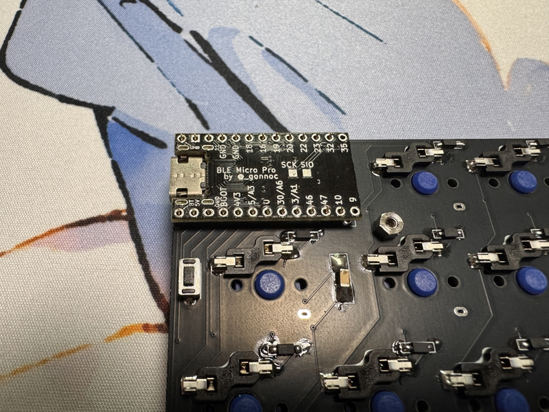

# cool937

## What is cool937?

cool937 is splite keyboards.
 
This keyboard has 37 keys.
 
This keyboard use Ble Micro Pro,run qmk_firmware.
 

## firmware

https://github.com/telzo2000/cool937/tree/main/firmware

## build guide

https://github.com/telzo2000/cool937/blob/main/buildguide_for_cool937.md

### summary

1 Diode soldering
 
2 Switch socket soldering
 
3  Battery Patrs,etc soldering
 
4 Ble Micro Pro and conthrough soldering
 
5 Install firmware
 
6 Fix the switch plate with screws
 
7 Insert the key switch
 
8 Fix the bottom case with screws.
 
9 Complete
 

## Parts list

| No. | Patrs | Quantity | remarks | Suppliers | Cost |
|--|--|--|--|--|--|
|番号|名前|数|備考|調達先|参考価格（送料込）| 
|1|PCB|2|37key|[elecrow](https://www.elecrow.com) [JLCPCB](https://jlcpcb.com) [ALLPCB](https://www.allpcb.com)|５枚で20〜30ドル| 
|2|BLE Micro Pro|2|MCU Board|[遊舎工房](https://shop.yushakobo.jp/products/ble-micro-pro?variant=37665571340449)|4950円|
|3|Swith socket スイッチソケット|37|choc V2|[遊舎工房](https://yushakobo.jp) [Talp Keyboard](https://talpkeyboard.net) [Daily Craft Keyboard](https://shop.dailycraft.jp)等|10個で165円程度|
|4|Diode ダイオード|37|SMD|[遊舎工房](https://yushakobo.jp) [Talp Keyboard](https://talpkeyboard.net) [Daily Craft Keyboard](https://shop.dailycraft.jp)等|100個で220円程度から|
|5|Switch plate|2|3D Print|||
|6|Bottom case|2|3D Print||
|7|Screw ネジ|16|M2 4mm|DIY shop|10本200円程度|
|8|Spacer スペーサー|8|M2 3mm|DIY shop|10本400円程度|
|9|Conthrou コンスルー|4|3.5mm|[遊舎工房](https://yushakobo.jp) [Talp Keyboard](https://talpkeyboard.net)|１個400円程度|
|11|Keyswitch キースイッチ|37|お好みで|[遊舎工房](https://yushakobo.jp) [Talp Keyboard](https://talpkeyboard.net) [Daily Craft Keyboard](https://shop.dailycraft.jp)|１個100程度|
|12|Keycap キーキャップ|37|1Ux38、1.5Ux2|[遊舎工房](https://yushakobo.jp) [Talp Keyboard](https://talpkeyboard.net) [Daily Craft Keyboard](https://shop.dailycraft.jp)||
|13|ボタン電池ホルダー|2|1632|[アリエク](https://ja.aliexpress.com/item/32744211091.html?spm=a2g0o.order_list.order_list_main.10.2aa6585aqrECYV&gatewayAdapt=glo2jpn) |100個で900円ほど|
|14|水平スライドスイッチ|2||[秋月電子](https://akizukidenshi.com/catalog/g/g115370/)|30円|
|15|チップ積層セラミックコンデンサー |2|100μF6.3V F 3216|[秋月電子](https://akizukidenshi.com/catalog/g/g102151/)|10個入り200円|

※12は、[FKcapsでのカスタムメイド](https://fkcaps.com/custom/9M9XVA)を参考にしてください。

※13,14,15は[遊舎工房のこれ](https://shop.yushakobo.jp/products/5623)が最適。

In addition, you will need a USB cable, etc.
 
この他に、USBケーブル等が必要です。
 

## lisence

[CC BY-NC-SA](https://creativecommons.org/licenses/by-nc-sa/4.0/deed.ja)

