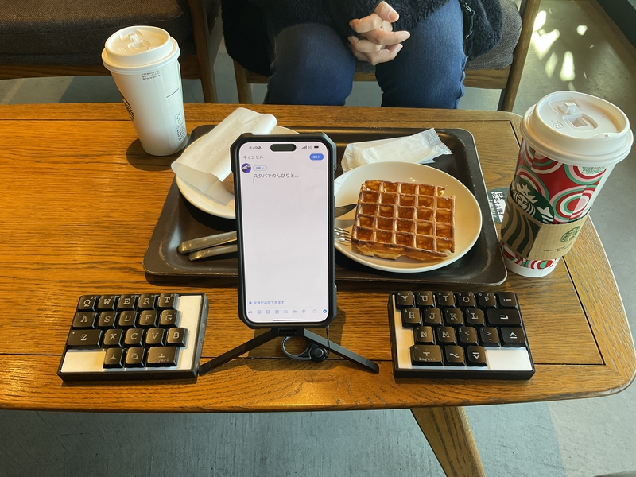

# Build guide

## Build 1

There are two PCBs. Check the front and back sides, and perform future work on both the left and right sides.
 
PCBが２枚あります。表裏を確認して、これからの作業は、左右とも行ってください。
 

表面
 

裏面
 

### 1 Diode soldering

Solder the diodes to the back of PCB.
 
PCBの裏面にダイオードのハンダ付けをします。
 
The diode is compatible with SMD.
 
ダイオードは、SMDに対応しています。
 
Diodes have polarity, so be careful about the direction in which they are installed.
 
ダイオードには極性がありますので、取り付ける向きに注意してください。
 

[ダイオード（SMD)のはんだ付けの動画](https://youtu.be/ODk16bd4XkA)

### 2 Switch socket soldering

Solder the switch sockets on the back side.
 
裏面にスイッチソケットのハンダ付けをします。
 

[８倍速　Switch socketハンダ付け動画](https://youtu.be/E__mHvmIXQo)

### 3 Reset switch soldering

Insert the reset switch from the back of the PCB and solder the exposed part.
 
リセットスイッチをPCBの裏面から差し込んで、表面に出た部分をはんだ付けしてください。
 

[リセットスイッチのはんだ付けの作業動画](https://youtu.be/Pl24Exfh8b8)

### 4 Battery parts soldering(Bluetooth option)

Solder the slide switch first.
 
最初にスライドスッチをはんだ付けします。
 

Insert the switch from the back of the PCB with the switch knob facing outward.
 
スイッチのつまみが外側に向くようにして、PCBの裏面から差し込みます。

After temporarily fixing it with masking tape, etc., solder the exposed part of the PCB.
 
マスキングテープなどで仮固定をしてから、PCBの表面に出た部分をはんだ付けします。
 

[スライドスイッチのはんだ付けの作業動画](https://youtu.be/5nkRklibay4)

 
Next, solder the capacitor.
 
次に、コンデンサをはんだ付けします。
 
 
First, apply solder to only one side of the two pads.
 
最初に、２つあるパッドの片側だけに、はんだを盛り付けます。
 
Place the capacitor and fix it by melting the solder.
 
コンデンサを置き、もったはんだを溶かしながら、固定します。
 
Solder the capacitor, applying solder to the remaining pads.
 
残りのパッドにはんだを盛りながら、コンデンサをはんだ付けします。
Finally, attach the battery holder.
 

[コンデンサのはんだ付け作業の動画](https://youtu.be/8CFiDMtg21s)

 

最後に、電池ホルダを取り付けます。
 
Insert it from the back side of the PCB and solder the front side. Using masking tape for temporary fixation will make the work easier.
 
PCBの裏面から差し込んで、表面をはんだ付けします。仮固定にマスキングテープを使うと作業が簡単になります。
 

[電池ホルダのはんだ付けの作業動画](https://youtu.be/ltA8kcLqso4)

### 5 BLE MIcro Pro
Please prepare two con-through (12 pin 3.5mm) instead of the pin header included with BLE Micro Pro.
 
BLE Micro Pro付属のピンヘッダではなく、コンスルー（12ピン 3.5mm）を２つ用意してください。

 
There is a small hole in the side of the conthru. Insert it into the PCB, being careful to orient the holes the same way.
 
コンスルーの側面に小さい穴が開いています。穴を同じ向きになるよう注意して、PCBに差し込んでください。
 
Insert the BLE Micro Pro into the con-through so that the side with the parts on it faces the PCB. If the BLE Micro Pro easily comes off from the con-through, we recommend soldering. However, due to the structure of the bottom plate of the 3D printer, I think it will be difficult to remove, so no soldering is necessary.
 
 BLE Micro Proの部品が載っている方がPCBに面するように、コンスルーに差し込んでください。もし、 BLE Micro Proがコンスルーから外れやすいときははんだ付けをお勧めします。ただし、3Dプリンタのボトムプレートの構造上、外れにくいと思うので、はんだ付け不要です。
 
When using a 12-pin con-through, insert it into the 12 holes counting from the USB side of the BLE Micro Pro.
 
コンスルー12ピンを使用するとき、BLE Micro ProのUSB側から数えて12箇所分の穴に差し込んでください。
 

### 6 Install firmware （BLE Micro Pro）

Here is an [article](https://sizu.me/m_ki/posts/4x8nhz6n44o1) on how to do it.
 
ここにやり方の[記事](https://sizu.me/m_ki/posts/4x8nhz6n44o1)があります。
 

### 7 Fix the switch plate 

Insert the M2 screws into the 3D printed switch plate and the PCB in that order, and secure them with M2 spacers from the bottom of the PCB.
 
3Dプリントのスイッチプレート、PCBの順でM2ネジの順で差し込み、PCB下面からM2スペーサーで固定します。
  

### 8 Insert the key switch

Insert the key switch from the switch plate side.
 
スイッチプレート側からキースイッチを差し込んでいきます。
 
 
For switch plates created by 3D printing, if the frame into which the switch is inserted is too tight, please process the inside with a knife or file.
 
3Dプリントで作成したスイッチプレートは、スイッチが差し込まれる枠がきつい時は、内側を刃物ややすりで加工するなどの対応をしてください。

 

### 9 Fix the bottom case with screws

Secure the spacer fixed to the bottom plate and PCB with four M2 screws.
 
ボトムプレートとPCBに固定したスペーサーをM2ネジ４本で固定します。

 

Perform the steps up to this point on each side.
 
ここまでの作業を左右それぞれで行ってください。
 

### 10 Complete

Attach your favorite keycaps and you're done.
 
お気に入りのキーキャップをつけて完成です。
 

 
Welcome to the world of the best keyboards.
 
最高のキーボードの世界にようこそ。
 

